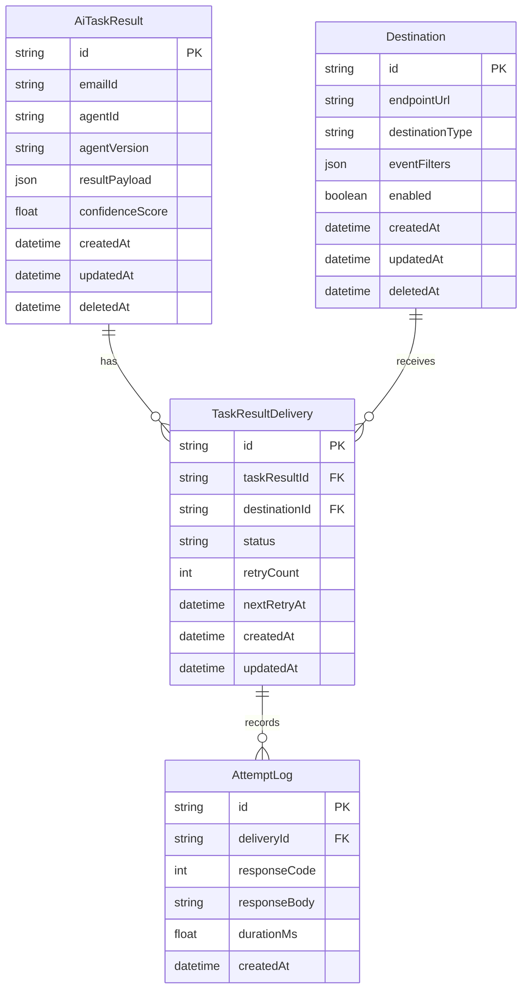
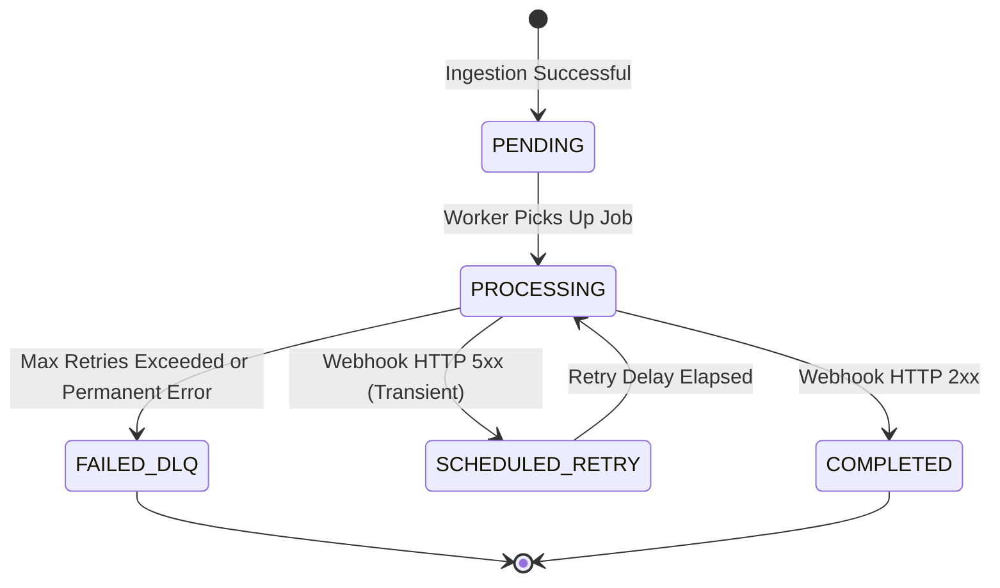

# System Architecture Diagrams

This document contains Mermaid and ASCII diagrams visualizing database structures, layer interactions, and pipeline execution flows.

---

## 💾 Database ER Diagram (Prisma Schema)



---

## 🔄 Delivery Lifecycle State Machine



---

## ⚡ Happy Path Data Flow

```
[Ingest API] ──► (Verify Idempotency)
      │
      ├──► Save to Postgres (AiTaskResult)
      │
      ├──► Publish to Redis (BullMQ main-queue)
            │
            ▼
      [Worker Node] ──► Query matching active Webhooks
            │
            ▼
      [Opossum Breaker] ──(CLOSED)──► POST payload to Destination URL
                                             │
                                             ▼
                                     Response HTTP 200 OK
                                             │
                                             ▼
                                     Mark completed in DB
```
