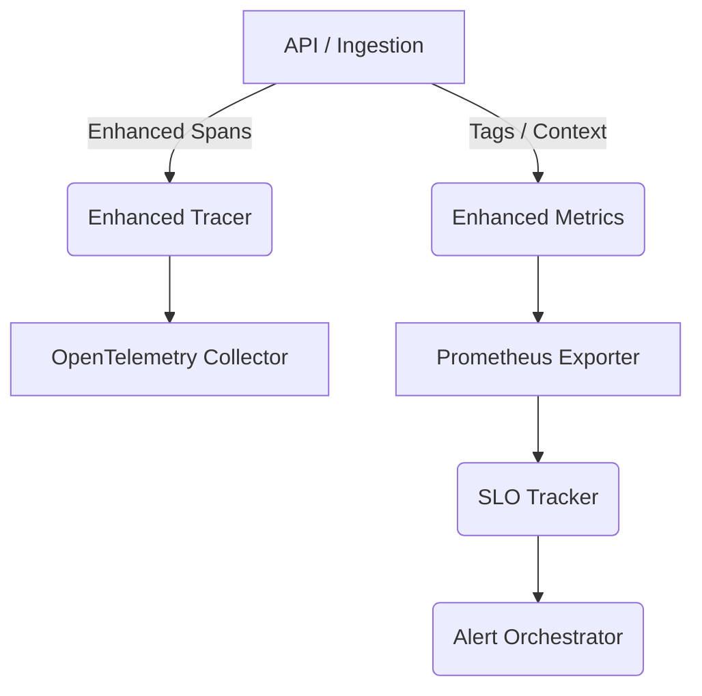

# Advanced Observability Guide

Advanced telemetry monitoring framework for QueueForge.

---

## 🏗️ Architecture

---

## 📈 Components
1.  **Enhanced Tracer**: Wraps spans with metadata attributes like `userId`, `emailId`, and `resultId`.
2.  **Enhanced Metrics**: Adds multidimensional histograms for latency calculations.
3.  **Anomaly Detection**: Evaluates rolling mean z-scores.
4.  **Log Correlation**: Propagates execution correlation IDs across asynchronous boundaries.
